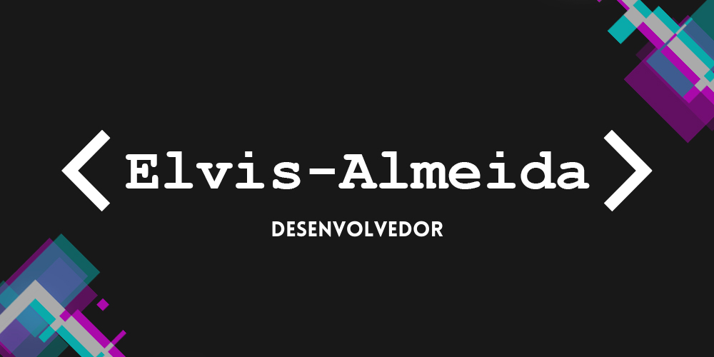
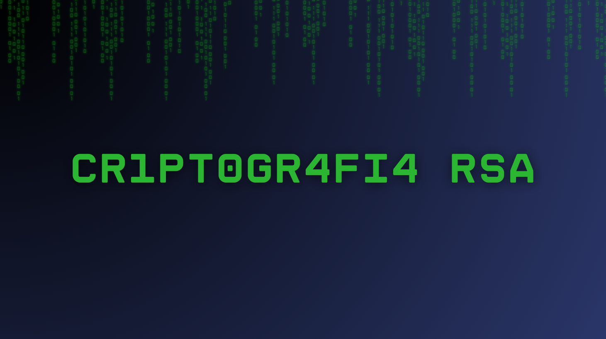
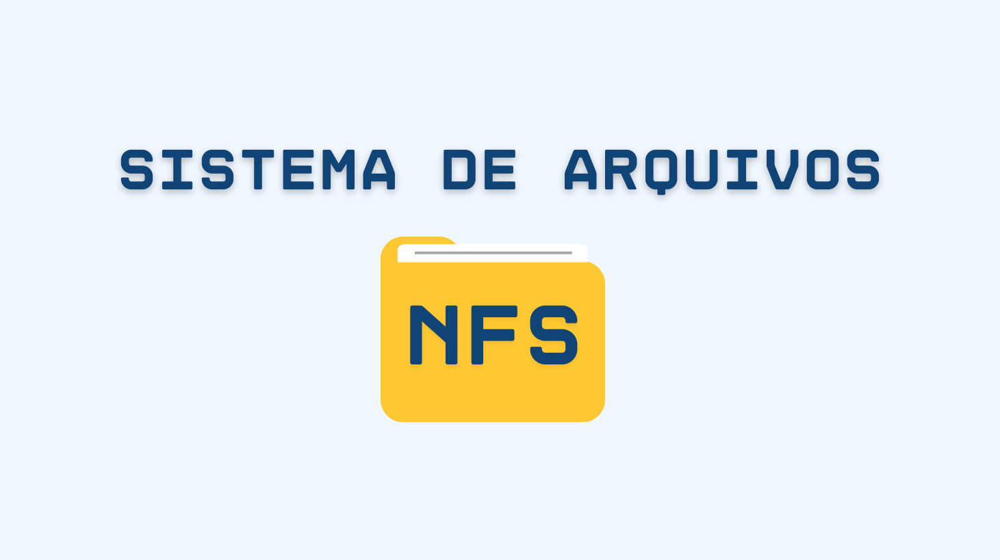

    

<!--          -->
        
        
        
        
        
        

 

<h4 align="center">

<h1 align="center">Olá eu sou o Elvis</h1></img>

    
    

##

        
    </a>

##

<h3 align="center">Projeto favorito:</h3>

    <a target="_blank" href="https://github.com/Elvis-Almeida/Elvis-Almeida-Servidor-Linux/wiki/01.-Introdu%C3%A7%C3%A3o">
        
        </img> </a>
          
    <a target="_blank" href="https://github.com/Elvis-Almeida/Elvis-Almeida-Servidor-Linux/wiki/01.-Introdu%C3%A7%C3%A3o">
        
        </img>
    </a>

##

<h3 align="center">Algoritmo de criptgrafia RSA:</h3>

    <a target="_blank" href="https://github.com/vinicius4006/RSA2">
        
        </img>
    </a>
      
    <a target="_blank" href="https://github.com/vinicius4006/RSA2">
        
        </img>    
    </a>

##

<h3 align="center">Sistema de arquivos NFS:</h3>

    <a target="_blank" href="https://github.com/wendersoon/sistema_NFS/wiki/Sistema-de-arquivos---NFS">
        
        </img>
    </a>
      
    <a target="_blank" href="https://github.com/wendersoon/sistema_NFS/wiki/Sistema-de-arquivos---NFS">
        
        </img>    
    </a>

##

<h3 align="center">Jogo da velha:</h3>

    <a target="_blank" href="https://github.com/Elvis-Almeida/Jogo-da-Velha">
        
        </img> </a>
          
    <a target="_blank" href="https://elvis-almeida.github.io/Jogo-da-Velha/">
        
        </img>
    </a>

##

<h3 align="center">Sobre mim:</h3>

Hello, my name is Elvis Almeida and I am a Computer Science student at the Federal Institute of Education, Science, and Technology of Maranhão - IFMA - Imperatriz Campus. I have skills in web development, including HTML, CSS, and JavaScript, as well as knowledge in Python and C. Currently, I am expanding my knowledge to include technologies such as Node.js, React, and Next.js. I am also improving my proficiency in the English language.

In addition to my studies, I have a significant achievement in the field of mathematics, with a bronze medal in the Brazilian Mathematics Olympiad of Public Schools (OBMEP) in 2016 and receiving honorable mentions in 2015, 2017, 2018, and 2019.

##

<h3 align="center">Contact:</h3>

<!--      -->
    <!-- 
    
    --> <a target="_blank" href="https://www.linkedin.com/in/elvis-almeida/">
        
    <!-- 
     -->

 
 

<picture>
  <source media="(prefers-color-scheme: dark)" srcset="https://raw.githubusercontent.com/Elvis-Almeida/Elvis-Almeida/output/github-contribution-grid-snake-dark.svg">
  <source media="(prefers-color-scheme: light)" srcset="https://raw.githubusercontent.com/Elvis-Almeida/Elvis-Almeida/output/github-contribution-grid-snake.svg">
  
</picture>

