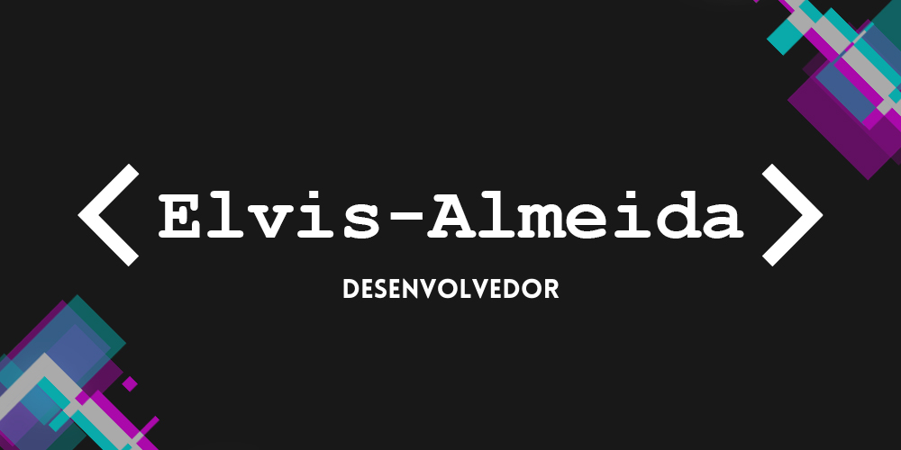

    

    
    
    
    
    
    
    

 

<h4 align="center">

<h1 align="center">Olá eu sou o Elvis</h1></img>

    
    

##

        
    </a>

##

<h3 align="center">Trabalhando em:</h3>

    <a href="https://github.com/Elvis-Almeida/Pagina-de-login">
        
        </img>
          
        
        </img>    
    </a>

##

<h3 align="center">Repositório favorito:</h3>

    <a href="https://github.com/Elvis-Almeida/Jogo-da-Velha">
        
        </img> </a>
          
    <a href="https://elvis-almeida.github.io/Jogo-da-Velha/">
        
        </img>
    </a>

##

<h3 align="center">Sobre mim:</h3>

Cursando ciência da computação

##

<h3 align="center">Contato:</h3>

    
    <!-- 
    
    <a href="https://www.linkedin.com/in/Elvis-Almeida/">
        
     -->

<h5 align="center">@elvisrodriguesalmeida</h5>
